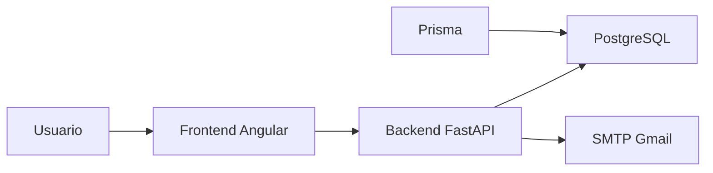

# Sistema TCC ICOMP


Sistema web em desenvolvimento para apoiar fluxos academicos do TCC no ICOMP, com foco inicial em autenticacao, cadastro de usuarios e comunicacao por e-mail. Este repositorio concentra o setup da Sprint 1 e a base tecnica que vai sustentar as proximas historias do produto.

O projeto foi pensado para servir a tres objetivos ao mesmo tempo:

- apoiar a execucao da disciplina com uma base organizada e auditavel
- facilitar o acompanhamento da professora orientadora e avaliadores
- funcionar como portfolio tecnico do time ao final do desenvolvimento

Guia completo de onboarding e execucao: [docs/guia-do-projeto.md](docs/guia-do-projeto.md)

## Visao do projeto

O sistema nasce como uma aplicacao full stack com frontend Angular, backend FastAPI, banco PostgreSQL e gerenciamento de schema com Prisma. A ideia central e oferecer uma base clara, escalavel e didatica para evoluir as regras de negocio do dominio academico sem perder organizacao tecnica.

Nesta fase, o repositorio ja entrega:

- estrutura de pastas para frontend, backend, banco, testes e documentacao
- API FastAPI com configuracao centralizada e endpoint `GET /health`
- frontend Angular com routing, modulo de autenticacao e tela inicial de login
- schema Prisma inicial com modelo `User`
- integracao planejada com Gmail SMTP via App Password
- workflow basico de CI para backend e frontend

## Arquitetura



### Papel de cada camada

- `frontend/`: interface, navegacao e experiencia do usuario
- `backend/`: API, regras de negocio, validacoes e integracoes
- `backend/prisma/`: schema e migrations do banco
- `docker-compose.yml`: subida local rapida do PostgreSQL
- `docs/`: documentacao tecnica e onboarding do time

## Stack tecnologica

### Backend

- Python
- FastAPI
- Uvicorn
- Pydantic Settings
- Pytest

### Frontend

- Angular
- TypeScript
- Angular Router
- Reactive Forms

### Dados e infraestrutura

- PostgreSQL
- Prisma
- Docker Compose
- GitHub Actions
- Gmail SMTP com App Password

## Escopo atual da Sprint 1

O repositorio cobre os cards de setup da sprint, preparando o terreno para as historias de:

- cadastro de coordenador
- cadastro de aluno e orientador
- login com perfis distintos
- redefinicao de senha por e-mail

O schema inicial contempla a entidade `User` com campos essenciais para o fluxo de autenticacao:

- `id`
- `nome_completo`
- `email`
- `username`
- `senha_hash`
- `perfil`
- `ativo`
- `criado_em`

## Estado atual

### Validado neste ambiente

- `pytest backend/tests`
- `npm install` em `backend/`
- `npm install` em `frontend/`
- `npm run build` em `frontend/`
- instalacao local de `Node.js`, `npm` e `Git`

### Pendente de validacao manual

- subir o frontend com `ng serve`
- aplicar `prisma migrate dev` com PostgreSQL ativo
- configurar protecao da branch `main` no GitHub remoto

## Execucao rapida

### 1. Criar os arquivos de ambiente

```powershell
Copy-Item .env.example .env
Copy-Item backend\.env.example backend\.env
```

### 2. Subir o PostgreSQL

```powershell
docker compose up -d db
```

### 3. Instalar dependencias Python

```powershell
python -m venv .venv
.venv\Scripts\Activate.ps1
pip install -r backend\requirements.txt
```

### 4. Instalar dependencias Node

```powershell
cd backend
npm.cmd install
cd ..\frontend
npm.cmd install
cd ..
```

### 5. Validar schema e banco com Prisma

```powershell
cd backend
.\node_modules\.bin\prisma.cmd validate
.\node_modules\.bin\prisma.cmd migrate dev --name init
cd ..
```

### 6. Rodar backend e frontend

Backend:

```powershell
uvicorn backend.app.main:app --reload
```

Frontend:

```powershell
cd frontend
npm.cmd run start
```

### 7. Testar a API

```powershell
Invoke-WebRequest http://127.0.0.1:8000/health
```

## Estrutura do repositorio

```text
.
|-- backend/
|   |-- app/
|   |-- prisma/
|   |-- scripts/
|   `-- tests/
|-- frontend/
|   |-- src/
|   `-- package.json
|-- docs/
|   |-- assets/
|   |-- github-setup.md
|   `-- guia-do-projeto.md
|-- .github/workflows/ci.yml
|-- .env.example
`-- docker-compose.yml
```

## Documentacao disponivel

- [docs/guia-do-projeto.md](docs/guia-do-projeto.md): onboarding completo, explicado para quem ainda esta comecando
- [docs/github-setup.md](docs/github-setup.md): fluxo de branches e configuracao do GitHub

## Qualidade e organizacao

Algumas decisoes importantes deste setup:

- separacao clara entre frontend, backend, banco e documentacao
- variaveis de ambiente documentadas com exemplos
- pipeline de CI preparada para backend e frontend
- servico de e-mail desacoplado para facilitar testes e futuras US
- base de autenticacao pensada para perfis distintos de usuario

## Integracao por e-mail

Enquanto nao ha confirmacao sobre Google Workspace institucional, o projeto esta preparado para usar Gmail SMTP com App Password. Isso permite validar os fluxos de boas-vindas e recuperacao de senha sem bloquear a sprint.

Script de teste:

```powershell
python backend\scripts\send_test_email.py --subject "Teste SMTP" --body "SMTP funcionando."
```

## Fluxo de trabalho do time

O fluxo sugerido para desenvolvimento e:

1. manter `main` como referencia estavel
2. usar `dev` como branch de integracao da sprint
3. desenvolver cada historia em `feature/us00x`
4. abrir PR para revisao antes de integrar

Mais detalhes em [docs/github-setup.md](docs/github-setup.md).

## Proximos passos tecnicos

- concluir a validacao de `prisma migrate dev` com o PostgreSQL ativo
- implementar as rotas de autenticacao e cadastro
- conectar o frontend ao backend real
- adicionar testes para regras de negocio das proximas US
- publicar o repositorio remoto com protecao de branch e badge real do CI

## Valor academico e de portfolio

Este projeto nao foi estruturado apenas para "funcionar". Ele tambem foi organizado para demonstrar:

- planejamento de sprint orientado por backlog
- separacao de responsabilidades entre camadas
- preocupacao com onboarding e documentacao
- uso combinado de API, banco, frontend, CI e integracao por e-mail

Por isso, mesmo nesta fase inicial, o repositorio ja serve como evidencia de maturidade tecnica, processo e colaboracao do time.
